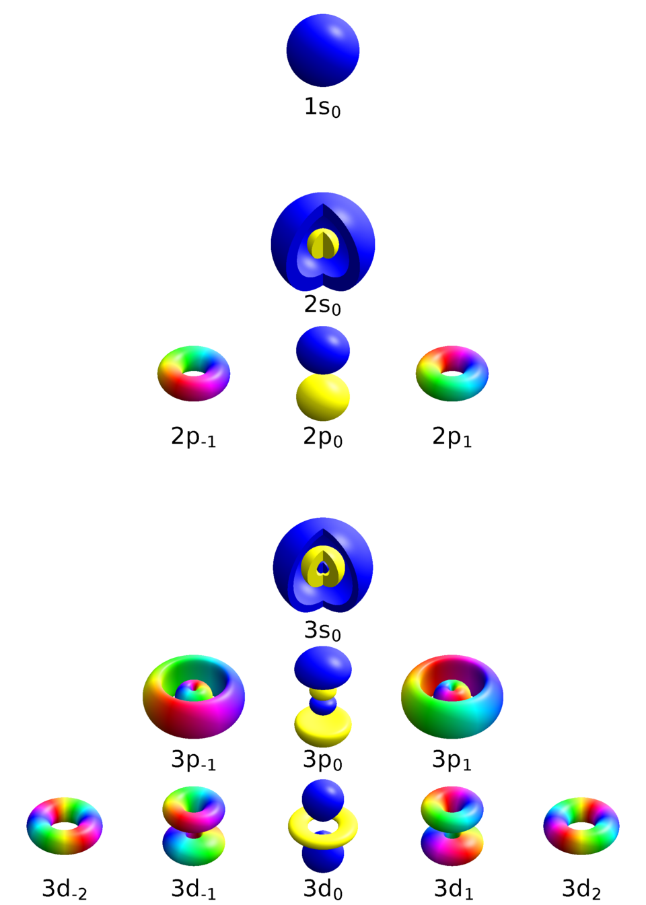

# Background

The position of a particle is described using spherical coordinates $(r, \theta,\phi)$. Quantum numbers are a set of four values; principal ($n$), azimuthal ($l$), magnetic ($m_l$), and spin ($m_s$). They uniquely define the energy, shape, orientation, and spin of electrons within an atom. They also dictate the arrangement of electrons in orbitals, with no two electrons in an atom sharing the same set. 
- Principal Quantum Number ($n$): Determines the main energy level or shell, where $n=1,2,3,...,\infty$. Higher $n$ means higher energy and larger orbital size.
- Azimuthal Quantum Number ($l$): Defines the subshell or shape of the orbital, ranging from $0$ to $n-1$ 
    - $l=0$ ($s$-subshell, spherical)
    - $l=1$ ($p$-subshell, dumbbell)
    - $l=2$ ($d$-subshell, cloverleaf)
    - $l=3$ ($f$-subshell, complex)
- Magnetic Quantum Number ($m$): Specifies the orientation of an orbital within a subshell, ranging from $-l$ to $+l$. It indicates the number of orbitals ($2l+1$) per subshell.
- Spin Quantum Number ($m_s$): Represents the intrinsic spin of the electron, with values of $+\frac{1}{2}$ (up) or $-\frac{1}{2}$ (down). 

We will ignore the spin, hence we use the quantum numbers $(n,l,m)$. Here comes a figure from [Wikipedia](https://en.wikipedia.org/wiki/Quantum_number), for cases $n=1,2,3$ (it is written in the form $n l_{m}$, where $l=s,p,d,f$).  

Now it's time to use the Schrödinger equation:

$$-\frac{\hbar^2}{2m_e}\nabla^2 \Psi+V(r)\Psi=E\Psi$$

where $\Psi(r,\theta,\phi)$ is the wavefunction, $\hbar$ is the reduced Planck constant, $m_e$ is the electron mass, $V$ is the potential energy and $E$ is the energy eigenvalue. Simplified, the equation yields "kinetic energy + potential energy = total energy". 

The probability density is given by:

$$P(r,\theta,\phi)=|\Psi(r,\theta,\phi)|^2$$

So, the probability of finding the electron in a volume element $d\tau$ is

$$dP=|\Psi|^2d\tau$$

with $d\tau = r^2 \sin \theta dr d\theta d\phi$.

For the hydrogen atom, the potential depends only on the distance $r$, so the system is spherically symmetric. We can use spherical coordinates. The wavefunction can therefore be split into its radial and angular components:

$$\Psi(r,\theta,\phi)=R(r)Y(\theta,\phi)$$

We will now use the Laplacian in spherical coordinates. It's given by:

$$\nabla^2 \Psi = \frac{1}{r^2}\frac{\partial}{\partial r}(r^2\frac{\partial \Psi}{\partial r})+\frac{1}{r^2 \sin \theta}\frac{\partial}{\partial \theta}(\sin \theta \frac{\partial \Psi}{\partial \theta})+\frac{1}{r^2 \sin^2 \theta}\frac{\partial^2 \Psi}{\partial \phi^2}$$

where we substitute for the wavefunction using the radial and angular components. Since $R$ depends only on $r$ and $Y$ only on $\theta,\phi$:

$$\frac{\partial \Psi}{\partial r}= Y\frac{dR}{dr}, \quad \frac{\partial \Psi}{\partial \theta}= R\frac{\partial Y}{\partial \theta}, \quad \frac{\partial \Psi}{\partial \phi}= R\frac{\partial Y}{\partial \phi}$$

So the Laplacian becomes:
$$\nabla^2 \Psi = Y \frac{1}{r^2} \frac{d}{dr}(r^2 \frac{dR}{dr})+\frac{R}{r^2} [\frac{1}{\sin \theta} \frac{\partial}{\partial \theta}(\sin \theta \frac{\partial Y}{\partial \theta})+\frac{1}{\sin^2 \theta}\frac{\partial^2 Y}{\partial \phi^2}]$$

We now put this into the Schrödinger’s equation:

$$-\frac{\hbar^2}{2m_e}[Y \frac{1}{r^2} \frac{d}{dr}(r^2 \frac{dR}{dr})+\frac{R}{r^2}( \frac{1}{\sin \theta} \frac{\partial}{\partial \theta}(\sin \theta \frac{\partial Y}{\partial \theta})+\frac{1}{\sin^2 \theta}\frac{\partial^2 Y}{\partial \phi^2})]+V(r)RY=ERY$$

Divide everything by $RY$:

$$-\frac{\hbar^2}{2m_e}[\frac{1}{R} \frac{1}{r^2} \frac{d}{dr}(r^2 \frac{dR}{dr})+\frac{1}{r^2} \frac{1}{Y} (\frac{1}{\sin \theta} \frac{\partial}{\partial \theta}(\sin \theta \frac{\partial Y}{\partial \theta})+\frac{1}{\sin^2 \theta}\frac{\partial^2 Y}{\partial \phi^2})]+V(r)=E$$

Multiply by $-2m_e r^2 / \hbar^2$:

$$\frac{1}{R}\frac{d}{dr}(r^2 \frac{dR}{dr})+ \frac{1}{Y} (\frac{1}{\sin \theta} \frac{\partial}{\partial \theta}(\sin \theta \frac{\partial Y}{\partial \theta})+\frac{1}{\sin^2 \theta}\frac{\partial^2 Y}{\partial \phi^2})+\frac{2m_e r^2}{\hbar^2}(E-V(r))=0$$

Now we can separate radial and angular parts:

$$\frac{1}{Y} (\frac{1}{\sin \theta} \frac{\partial}{\partial \theta}(\sin \theta \frac{\partial Y}{\partial \theta})+\frac{1}{\sin^2 \theta}\frac{\partial^2 Y}{\partial \phi^2}) =- [\frac{1}{R}\frac{d}{dr}(r^2 \frac{dR}{dr})+\frac{2m_e r^2}{\hbar^2}(E-V(r))]$$

Now the left side depends only on angles and the right side only on $r$, so both must be equal to the same constant, taken as

$$-l(l+1)$$

Angular equation:

$$\frac{1}{\sin \theta} \frac{\partial}{\partial \theta}(\sin \theta \frac{\partial Y}{\partial \theta})+\frac{1}{\sin^2 \theta}\frac{\partial^2 Y}{\partial \phi^2}+l(l+1)Y=0$$

This is an equation whose solutions are spherical harmonics $Y_l^m (\theta,\phi)$

Radial equation:

$$\frac{d}{dr}(r^2 \frac{dR}{dr})+[\frac{2m_e r^2}{\hbar^2}(E-V(r))-l(l+1)]R=0$$

We are going to use the hydrogen atom, where the potential $V(r)$ is the Coulomb potential,

$$V(r)=-\frac{e^2}{4\pi \epsilon_0 r}$$

Substituting into radial equation gives:

$$\frac{d}{dr}(r^2 \frac{dR}{dr})+[\frac{2m_e r^2E}{\hbar^2}+\frac{2m_e e^2}{4\pi \epsilon_0 \hbar^2}r-l(l+1)]R=0$$

To simplify this equation, define a new function

$$u(r)=rR(r)$$

Then it becomes:

$$\frac{d^2u}{dr^2}+[\frac{2m_e}{\hbar^2}(E+\frac{e^2}{4\pi \epsilon_0r})-\frac{l(l+1)}{r^2}]u=0$$

Now we look at how the solution behaves in two limits. Near $r=0$, the dominant term is the centrifugal term $\frac{l(l+1)}{r^2}$, so the regular solution behaves like 

$$u(r) ~ r^{l+1}$$

For large $r$, the bound-state solution behaves like

$$u(r) ~ e^{-r/(na_0)}$$

This suggests writing the solution in the form

$$u(r)=\rho^{l+1}e^{-\rho/2}v(\rho)$$

where we introduce the dimensionless variable 

$$\rho = \frac{2r}{na_0}$$

Here $a_0$ is the Bohr radius:

$$a_0=\frac{4\pi\epsilon_0 \hbar^2}{m_e e^2}$$

After substituting this form into the radial equation and simplifying, the remaining function $v(\rho)$ satisfies the associated Laguerre differential equation. Its acceptable solutions are the associated Laguerre polynomials,

$$v(\rho)=L_{n-l-1}^{2l+1}(\rho)$$

Therefore, the normalized hydrogen radial wavefunction is

$$R_{nl}(r)=\sqrt{(\frac{2}{na_0})^3\frac{(n-l-1)!}{2n (n+l)!}}e^{-\rho/2}\rho^l L_{n-l-1}^{2l+1}(\rho)$$

This is the standard radial solution for the hydrogen atom.

### Angular part

We separate 

$$Y(\theta,\phi)=\Theta (\theta) \Phi(\phi)$$

which gives:

$$\frac{1}{\Phi}\frac{d^2\Phi}{d\phi^2}=-m^2$$

so:

$$\frac{1}{\sin \theta}\frac{d}{d\theta}(\sin \theta \frac{d\Theta}{d\theta})+(l(l+1)-\frac{m^2}{\sin^2\theta})\Theta=0$$

Some rewriting gives:

$$\frac{\sin \theta}{\Theta}\frac{d}{d\theta}(\sin \theta \frac{d\Theta}{d\theta})+\frac{1}{\Phi} \frac{d^2\Phi}{d\phi^2}+l(l+1)\sin^2\theta=0$$

The $\theta$-dependent terms and the $\phi$-dependent terms must each be equal to a constant. We write that constant as $-m^2$.

Now we can solve the $\phi$ equation:

$$\frac{d^2\Phi}{d\phi^2}+m^2\Phi=0$$

Its solution is

$$\Phi(\phi)=Ae^{im\phi}+Be^{-im\phi}$$

For the wavefunction to be single-valued, we need

$$\Phi(\phi +2\pi)=\Phi(\phi)$$

which forces $m$ to be an integer.

We choose the normalized solution

$$\Phi_m(\phi)=\frac{1}{\sqrt{2\pi}}e^{im\phi}$$

Then the probability density in $\phi$ is 

$$|\Phi_m(\phi)|^2=\frac{1}{2\pi}=P(\phi)$$

for a definite $m$-state.

Now we can solve the $\theta$ equation. We have from earlier:

$$\frac{\sin \theta}{\Theta}\frac{d}{d\theta}(\sin \theta \frac{d\Theta}{d\theta})+\frac{1}{\Phi} \frac{d^2\Phi}{d\phi^2}+l(l+1)\sin^2\theta=0$$

This is solved using the Legendre functions:

$$\Theta(\theta) \propto P^m_l (\cos \theta)$$

After normalization, the angular part is combined into the spherical harmonic

$$Y_l^m (\theta,\phi)=N_{lm}P^m_l (\cos \theta) e^{im\phi}$$

where $N_{lm}$ is a normalization constant.

The angular probability density is 

$$|Y^m_l (\theta,\phi)|^2$$

But in spherical coordinates, the solid-angle element is

$$d\Omega =\sin \theta d\theta d\phi$$

So the probability of finding the particle between $\theta$ and $\theta+d\theta$, and between $\phi$ and $\phi+d\phi$, is 

$$dP=|Y^m_l (\theta,\phi)|^2\sin \theta d\theta d\phi$$

To get the probability as a function of $\theta$ only, integrate over $\phi$:

$$P(\theta)d\theta=\int_0^{2\pi}|Y^m_l (\theta,\phi)|^2\sin \theta d\phi d\theta$$

Since 

$$Y^m_l (\theta,\phi)=N_{lm}P^m_l(\cos \theta)e^{im\phi}$$

we have 

$$|Y^m_l (\theta,\phi)|^2=|N_{lm}|^2[P^m_l(\cos \theta)]^2$$

So

$$P(\theta) \propto \sin \theta (P^m_l(\cos \theta))^2$$

Let's recap:

$$R_{nl}(r)=\sqrt{(\frac{2}{na_0})^3\frac{(n-l-1)!}{2n (n+l)!}}e^{-\rho/2}\rho^l L_{n-l-1}^{2l+1}(\rho), \quad \rho=\frac{2r}{na_0}$$

$$P(\phi)=\frac{1}{2\pi}$$

$$P(\theta) \propto \sin \theta (P^m_l(\cos \theta))^2$$